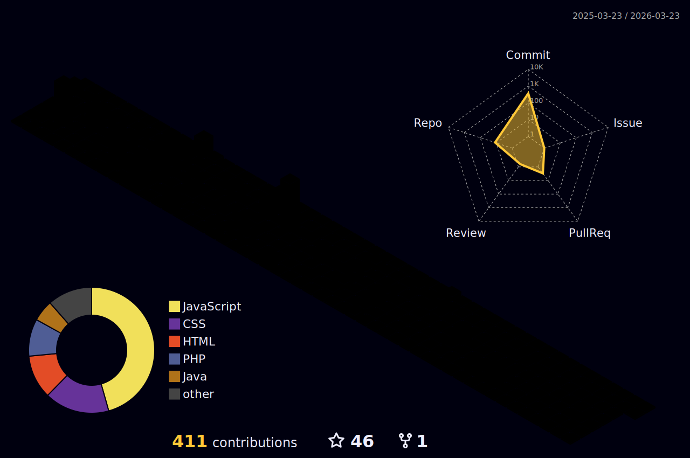

<h1 align="center">
  
</h1>

## 🌟 Welcome to My GitHub!

### 💻 About Me

🎓 I'm Yan Fellippe, a Computer Science student.

👨‍💻 Fullstack Developer with 5 years of programming experience.

🚀 Passionate about solving problems and building innovative tech solutions.

🤝 Open to collaboration on exciting and impactful projects.

## 🌐 Connect with Me

 
  
   
  
  
  

  <a href="https://github.com/YanFellippe">
    
      

  

  
  
  

## 🛠️ Tech Stack
  
### 👨‍💻 Programming Languages  

### 🧰 Frameworks & Libraries  

### 🗄️ Databases  

### 🔧 Tools & DevOps  

### 🧪 Others  

## 🏆 Certifications

### 🏆 Achievements

  

  <h3>👀 Visitor Counter</h3>
  <!-- Visualização de perfil (Komarev) -->
  

    
  

  
  

