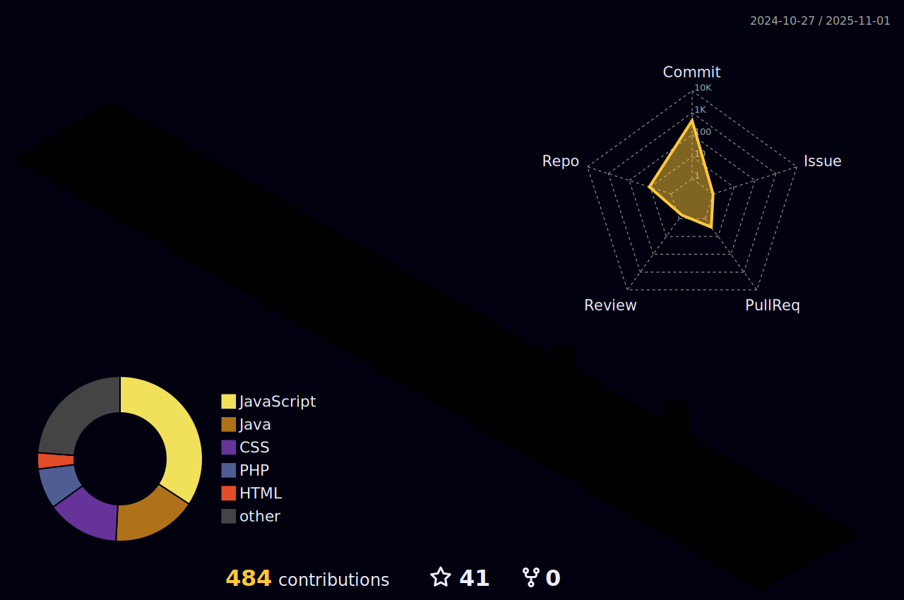

<h1 align="center">
  
</h1>

🌟 Welcome to My GitHub!

💻 About Me:
I'm Yan Fellippe, a Computer Science student specializing in fullstack development. With 5 years of programming experience, I’m passionate about solving problems and creating innovative tech solutions.

📂 My Projects:
Here, you'll find a variety of projects, from complete web applications to handy tools for developers.

🌱 What I’m Learning Now:
Currently diving into advanced technologies and exploring ways to make my applications more scalable and efficient.

🌟 My Mission:
I believe in the power of technology to turn ideas into reality and in the importance of collaboration to grow as a developer.

📩 Let’s Collaborate!
Feel free to explore my repositories, contribute, or reach out to share ideas about projects, technology, or development.

  

  

### 🛠️ Tech Stack

<!--

  
  
  
  
  
  
  
  
  
  
  
  
  
  
  
  
  
  
  
  
                         

-->
  

### 🌐 Connect with Me

 
  
   
  
  
  

### 🏆 Achievements

  

  
You're the visitor:

  

